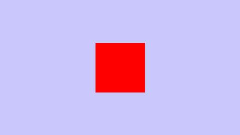

# Aufgabe 1

## Bild

## Hintergrund

Der Hintergrund ist konstant *blau*. Die Aufgabe fordert einen Blauverlauf in vertikaler Richtung.

## Quadrat

Hier wird ein Quadrat mit der Kantenlänge 100 Pixel gerendert. Die Aufgabe fordert eine Kreisscheibe.

