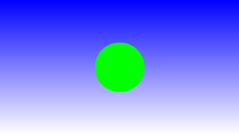

# Aufgabe 1

Diese Datei ist ein Beispiel für den Aufbau der Dokumentation, die zusammen mit der Implementierung
jeder Lösung zu erstellen ist. Der Basisname der Datei entspricht der *Id* der Aufgabe, in diesem Fall
ist der Name also `a01.md`.

## Bild



Auch das Bild ist nach der *Id* der Aufgabe benannt. In diesem Fall: `a01.png`.

## Lösung

Der Kern der Lösung ist in der Methode `colorForGreenCircleOnBlueToWhite(int x, int y)` zu sehen. Diese Methode entscheidet
abhängig von der Position des Pixels im Bild, welche Farbe der Pixel erhält.

```java
static int colorForGreenCircleOnBlueToWhite(int x, int y) {		
		int r = 50;
		//if (Math.abs(width / 2 - x) < size/2 && Math.abs(height / 2 - y) < size/2 )
                int temp;
                if (Math.pow(x-width/2,2)+Math.pow(y-height/2,2)<= Math.pow(r,2))
			return new Color(0, 255, 0).getRGB();
	       temp=255*y/height;
        
		return new Color(temp, temp, 255).getRGB();
                        
	}
```

### Hintergrund

Der Hintergrund verläuft vertikal von blau zum weiß. Für jeden Wert von y wird ein neuer konstanter Farbwert erzeugt für die x-Achse.


### Kreis

Es wird ein Kreis mit dem Radius 50 Pixel dargestellt. Dazu wird der Mittelpunkt des Bildes
berechnet. Mit der Hilfe von Pythagoras-Satz wird jeder Pixel vom Zentrum zu äußersten Punkt mit dem Radius 50 Pixel
*grün* eingefärbt, alle anderen Pixel erhalten die Hintergrundfarbe.


## Quellen

https://pl.wikipedia.org/wiki/Ko%C5%82o
https://www.youtube.com/watch?v=GcJ06tSTDCI
