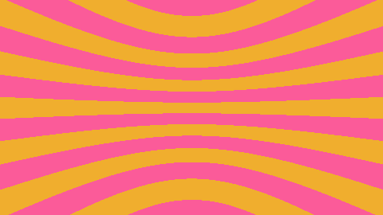

# Aufgabe 3

Strahlerzeugung.

## Aufgabe 3.1 Vektoren

Ich habe eine neue Klasse Vec3 implementiert mit allen geforderten Eigenschaften. Rheine Übersetzung von mathematische Formeln ins Java.

## Aufgabe 3.2: Strahl

Ich habe eine neue Klasse Ray erstellt zur Darstellung einen Strahl in dreidimensionalen Raum. Konstruktor der Klasse hat zwei Parameter: zwei Vektoren: erste repräsentiert Ursprung des Strahls und zweite seie normalisierte Richtung. Das war auch eigentlich nur rheine Übersetzung davon was in mathemathischen Formeln steht und in Aufgabenstellung steht.

### Aufgabe 3.3: Lochkamera 

Ich habe die dritte Klasse Kamera erstellt die eine einfache stationäre Lochkamera räpresentiert, die durch Angabe eines Kameraöffnungswinkels und einer Bildgröße konfiguriert wird. Deshalb brauchen wir im Konstruktor 3 Eigenschaften: Höhe, Breite und den Winkel. Ursprung wird automatisch auf den Vektor (0,0,0) konfiguriert.

Klasse hat eine Methode generateRay(int x, int y), die einen Strahl generiert. Es ist auch eine einfache Übersetzung der Formel, der wir an der Tafel letztens erstellt haben. Methode gibt einen Strahl zurück.

```java
 public Ray generateRay(int x, int y){
        
    Vec3 normalisierteRichtung= new Vec3(-(width/2)+x,(height/2)-y,-((height/2)/(Math.tan(winkel/2))));
        
        
        
   return new Ray(ursprung,normalisierteRichtung.normalisierung());
        
    }
```

### Aufgabe 3.4: Hintergrund

Dafür habe ich eine neue Main Klasse erstellt. Hier wird ein neues Kamera-Objekt erstellt und konfiguriert mit dem Winkel aus der Aufgabenstellung und freiwählbaren Höhe und Breite. In zwei for-to-do Schleifen wird für jedes Pixel einen Strahl erzeugt. Für jeden geraden Wert der y-Koordinate des Richtunsgvektor wird eine Random Farbe zugerodnet und für alle ungerade eine andere Random Farbe gewählt. Die Anzahl von Streifen entscheidet die Konstante mit dem die y-Wert multipliziert wurde.


```java
 if (Math.round(ray.normalisierteRichtung.y*10) % 2 == 0) {

                    entscheiden = EINS;

                } else {
                    entscheiden = ZWEI;

                }
            
                image.setRGB(x, y, gammakorrektur(entscheiden).getRGB());
            }
```



Die Lösung der Aufgabe 3.4. Das Bild entspricht einer Fotografie vom Inneren einer gestreiften Röhre.


## Quellen
nur Skript
