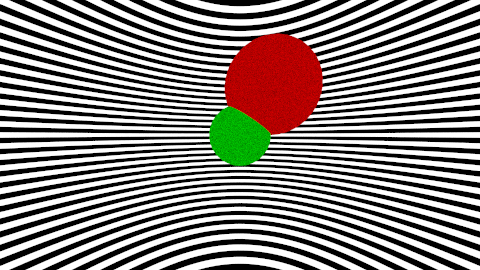

# Aufgabe 5

Reflexion. Funktioniert immer noch nicht, aber so wie heute bei der Übung besprochen - trotzdem hochgeladen. Gute Besserung!

## Aufgabe 5.1: Material

Ich habe ein Interface Material und eine Klasse Scattered wie beschrieben entworfen. Diese Teilaufgabe war trivial, man braucht hier keine zusätzliche Erklärungen.

## Aufgabe 5.2: Umbauarbeiten

Ich habe der Konstruktor der Klassen, die das Interface Shape implementieren, um Material als Parameter ergänzt

```java
  public Sphere(Vec3 position, Material material, double r)
    {
    this.position=position;
    this.material=material;
    this.r=r;
    }

```

```java
 public Background(Material material){
     this. material=material;  
    }

```

```java
public Hit(double t, Vec3 intersection, Material material, Vec3 normalisierteVector){
        this.t =t;
        this.intersection=intersection;
        this.material=material;       
        this.normalisierteVector=normalisierteVector;
        
    }
```


Ich habe auch die getHit()-Methode entsprechend modifiziert und raytrace() Methode entsprechend modifiziert. Ich habe auch zwei Klassen BackgroundMaterial und LambertMaterial, die von der Material Interface abgeleitet sind.

## Aufgabe 5.3: Rekursive Strahlverfolgung

Ich habe rekursive Methode implementiert die von der depth begrenzt ist. Die Abbruchbedingung ist dann, wenn depth Wert 0 erreicht. Dann muss die Methode die schwarze Farbe zurückgebe- d. h. es wurde keine Strahlquelle getroffen. Ich habe einfach die Pseudo-Code in den richtigen Code umformuliert.

```java
public Vec3 calculateRadiance(Group group, Ray ray, int depth) {
        if (depth==0) return new Vec3(0,0,0);
        Hit hit = group.getHit(ray);
        Vec3 emitted = hit.material.emitted(ray, hit);
        Scattered scattered = hit.material.scattered(ray, hit);
        if (scattered != null) {

            return emitted.add(scattered.albedo.elementaryMultiply(calculateRadiance(group, scattered.scattered, depth-1)));
        } else {
            return emitted;
        }
    }
```
## Aufgabe 5.4: Perfekt Diffuses Material

Ich habe zwei konkrete Materialien: BackgroundMaterial und LambertMaterial implementiert, die von das Interface abgeleitet wurden. Ich habe die Klasse Hit um Informationen über den Normalenvektor im Trefferpunkt ergänzt:

```java
   public Hit(double t, Vec3 intersection, Material material, Vec3 normalenvektor){
        this.t =t;
        this.intersection=intersection;
        this.material=material;       
        this.normalenvektor=normalenvektor;
    }
    
```
und die Methode getHit in Sphere habe ich entsprechend geändert:

```java
return new Hit(t,ray.pointAt(t), material, ray.pointAt(t).minus(position).normalisierung()); 
```

Die Methode für die gestreute Strahlrichtung sieht so aus:

```java
public Scattered scattered(Ray r, Hit h) {
        Vec3 scatteredUrsprung = h.intersection;
        Vec3 randomVec = new Vec3(2 * cgtools.Random.random() - 1, 2 * cgtools.Random.random() - 1, 2 * cgtools.Random.random() - 1);

        Vec3 scatteredNormalisierterichtung = (h.normalenvektor.add(randomVec).normalisierung());
        Ray scattered = new Ray(scatteredUrsprung, scatteredNormalisierterichtung);

        return new Scattered(scattered, albedoFarbe, false);
    }
```

## Aufgabe 5.4: Beleuchtete Szene

Beleuchtete Szene, die leider immer noch nicht funktioniert. :(



## Quellen
nur Skript
