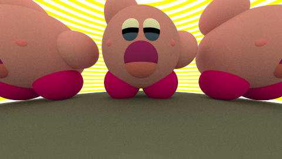
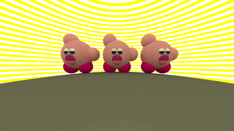
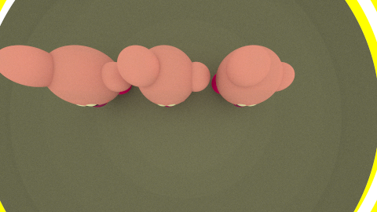
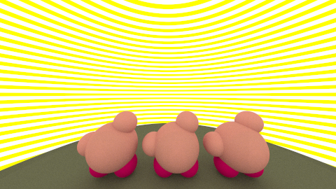

# Aufgabe 6

Bewegliche Kamera

## Aufgabe 6.1: Transformierbare Kamera

Klasse Mat4 wurde in der Kamera-Klasse importiert und im Konstruktor als einen Parameter übergeben. Methode generateRay() habe ich entsprechend modifiziert, ganz am Ende im return statement mit Methoden transformPoint für das Urprungspunkt, und transformDirection für die normalisierte Richtung.

```java
return new Ray(transformationsmatrix.transformPoint(ursprung),transformationsmatrix.transformDirection(normalisierteRichtung));     
        
   
```

## Aufgabe 6.2: Ansichten einer Szene


Ich habe mich für Kirby (Nintendo Charakter)entschieden, weil er fast nur aus Kugeln besteht. Man kann beliebig viele Kirbys mit x-Abstand mit der Methode listeAusfuellen(int anzahlKirbies, double abstandx) erzeugt. 

```java
   private static void listeAusfuellen(int anzahlKirbies, double abstandx) {
        shapes = new Shape[15*anzahlKirbies+2];
        shapes[0] = new Background(backgroundMat);
        
       for(int zaehler=0; zaehler<anzahlKirbies; zaehler++){

        //fuss links
       
        int temp=0;
        if (zaehler%2 ==0 && zaehler!=0){
               temp = zaehler-1;
                       }
        if(zaehler%2 !=0 && zaehler!=0){
            
            temp=-zaehler;
        }
          
             shapes[1+15*zaehler] = new Sphere(new Vec3(-20+abstandx*temp,-3,-90), farbeFuesse, 20);
 
                shapes[2+15*zaehler] = new Sphere(new Vec3(20+abstandx*temp,-3,-90), farbeFuesse, 20);
                //fuss rechts
                shapes[3+15*zaehler] = new Sphere(new Vec3(0+abstandx*temp,30,-90), farbeBody, 40);
                //body
                shapes[4+15*zaehler] = new Sphere(new Vec3(-20+abstandx*temp,70,-90),farbeBody, 20);
                //linkes hand oben
                shapes[5+15*zaehler] = new Sphere(new Vec3(40+abstandx*temp,32,-90),farbeBody,20);
                //rechtes hand unten
                shapes[6+15*zaehler] = new Sphere(new Vec3(-20+abstandx*temp,27,-62),policzki,6);
                shapes[7+15*zaehler] = new Sphere(new Vec3(20+abstandx*temp,27,-62),policzki,6);
                shapes[8+15*zaehler] = new Sphere(new Vec3(0+abstandx*temp,17,-62),mund,14);
                shapes[9+15*zaehler] = new Sphere(new Vec3(0+abstandx*temp,14,-62),zunge,13);
                shapes[10+15*zaehler]= new Sphere(new Vec3(-5+abstandx*temp,33,-62),augenWhite, 12.4);
                shapes[11+15*zaehler]= new Sphere(new Vec3(5+abstandx*temp,33,-62), augenWhite, 12.4);
                shapes[12+15*zaehler] = new Sphere(new Vec3(-5+abstandx*temp,31,-62), augenBlack, 12.5);
              shapes[13+15*zaehler] = new Sphere(new Vec3(5+abstandx*temp,31,-62), augenBlack, 12.5);
              shapes[14+15*zaehler] = new Sphere(new Vec3(5+abstandx*temp,30,-62), augenBlue, 12.4);
              shapes[15+15*zaehler] = new Sphere(new Vec3(-5+abstandx*temp,30,-62), augenBlue, 12.4);
       }

        shapes[15*anzahlKirbies+1]= new Sphere(new Vec3(0, -1518, -25), lam3,1500);
    

    }
```

Ich habe mit der Hilfe von statischen Methoden ein paar Matrizen erzeugt um die Kamera verschieden zu positionieren.

```java
    static final Mat4 SCALE=Mat4.scale(1,1,1);
```



Hier wurde die Position der Kamera gar nichg geändert. Skalierungsmatrix mit nur Einsen ist ein Einheitsmatrix, d. h. der Vektor wuerde gar nicht verändert.


```java
     static final Mat4 VORN = Mat4.translate(new Vec3(0,0,100));
```



Hier wurde die Position der Kamera in positive Z-Richtung verändert, so dass man die alle Kirbys von weiter sieht.

```java
   static final Mat4 OBEN =Mat4.translate(new Vec3(30,180,-50)).mult(Mat4.rotate(10,0,0,-90)); 

```



Hier wurde der Position der Kamera um negative 90 um x-Achse rotiert und der Position entsprechend verändert, so dass man alle Kirbys von oben sieht.

```java
   static final Mat4 HINTEN =Mat4.translate(new Vec3(14,120,-260)).mult(Mat4.rotate(0,10,0,-180)); 
```



Hier wurde der Position der Kamera um negative 180 um y-Achse rotiert und der Position entsprechend verändert, so dass man alle Kirbys von hinten schräg sieht.


## Quellen
Nur Folien aus der Vorlesung und Bild von Kirby auf die offiziele Nintendo-Seite www.nintendo.de 
