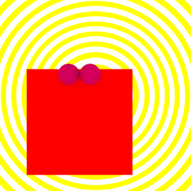
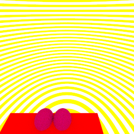
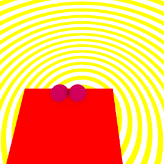
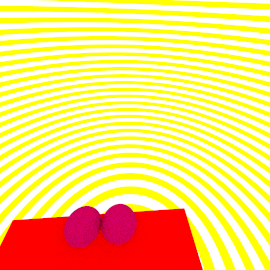

# Aufgabe 6

Bewegliche Kamera

## Aufgabe 7.1: Transformation und Inverse

Ich habe eine neue Klasse Transform erstellt, wo man mit einem lesenden Zugriff (public final) auf die Matrix der Transformation und der Inversen Transformation zugreifen kann. 

```java
public class Transform {
public final Mat4 transformation;
public final Mat4 inversion;

public Transform(Mat4 transformation){
    this.transformation=transformation;
    this.inversion=transformation.invertFull();
    
    
}
}
```

## Aufgabe 7.2: Transformierbare Shapes im Szenengraphen


Ich habe meine Klasse Group um ein Transformationsattribut erweitert. 

```java
    Transform transform;

    public Group(Shape[] shapes, Transform transform) {
        this.shapes = shapes;
        this.transform = transform;
    } 
```

Ganz am Anfang habe ich mir aus meiner Transformtionsobjekt mein Matrix der Transformation und Matrix der inversen Transformation geholt.Zusätzlich habe ich meine Inverse transposiert, sodass ich mein Strahl aus globalen System wieder zurück in lokale System transformieren kann. Ganz am Anfang habe ich mein Strahl in globale System transformiert und ganz am Ende der Methode habe ich in meiner Hitklasse der Schnittpunkt und Normalenvektor zurück in lokale System transformiert.

```java
public Hit getHit(Ray ray){
        Mat4 transformToWorld = transform.transformation;
        Mat4 transformToLocal = transform.inversion;
        Mat4 transformToLocalTransposed = transformToLocal.transpose();
        ray = new Ray(transformToWorld.transformPoint(ray.ursprung), transformToWorld.transformDirection(ray.normalisierteRichtung));

        Hit hit = null;
        double min = Double.POSITIVE_INFINITY;
        for (Shape shape : shapes) {
                if (shape.getHit(ray) != null && shape.getHit(ray).t <= min) {
                    min = shape.getHit(ray).t;
                    hit = shape.getHit(ray);

                
            }
        }
        if (hit!=null){
                
         hit.intersection=transformToLocal.transformPoint(hit.intersection);
         hit.normalenvektor=transformToLocalTransposed.transformDirection(hit.normalenvektor);
         
            
        }
        return hit;
    }

```

## Aufgabe 7.3: Ebene

Bei dieser Methode habe ich so viel Zeit verschwendet. Wir haben am bei der Übung gesprochen und wir können den Fehler nicht finden. Statt der erwartenden rote Ebene erscheinte immer einen Rechteck mit großen schwarzen Kugeln. Ich habe es nach der 6-Stundigen-Suche den Fehler behoben. Man muss t0 mit 0.0001 statt mit 0 deklarieren. Ich kann nicht so wirklich nachvollziehen, warum ist es so aber so funktioniert es.

Ich habe eine neue Klasse Rectangle erstellt, die Shape-Klasse implementiert. Bei der Konstruktor kann man die Breite und Tiefe eingeben, mit der Hilfe man die Größe der Ebene begrenzen kann. Bei der getHit()-Methode habe ich so die Gleichung umformuliert, sodass ich auf das Wert t komme. Wenn Skalar der Strahlrichtung mit der Normalenvektor der Ebenengleichung für y=0 größer als 0 ist, d. h. man guckt auf die Szene von unten, d. h. man muss bei dem Normalenvektor der Ebenengleichung der y-Wert auf -1 ändern. Die Ebene soll ganz im Zentrum liegen, deshalb habe ich geprüft ob die Breite bzw Tiefe in positiver Richtung und negativer Richtung gleich der Hälte der Begrenzung von der Breite bzw. Tiefe im Konstruktor ist. Nur wenn die Breite und Tiefe sich in der Begrenzung befindet, kann die Methode einen Hit zurückgeben. 

```java
 double x;
    double z;
    Material material;

    public Rectangle(double breite, double tiefe, Material material) {
        this.x = breite;
        this.z = tiefe;
        this.material = material;

    }

    public Hit getHit(Ray ray) {
        Hit hit = null;
        Vec3 n = new Vec3(0, 1, 0);
        double temp = (n.skalar(ray.normalisierteRichtung));
        if (temp==0){
            return null;
        }
        double t = n.skalar(ray.ursprung) * (-1) / temp;
        if (t >= ray.t0 && t <= ray.t1) {
            Vec3 pos = ray.pointAt(t);
            if (n.skalar(ray.normalisierteRichtung) > 0) {

                n.y = -1.0; 

            }

           if(pos.x>=-this.x/2 && pos.x<=this.x/2 && pos.z>=-this.z/2 && pos.z<=this.z/2){
		hit = new Hit(t, pos, material, n);
			}
        }

        return hit;
    }
```

## Aufgabe 7.4: Ansichten einer Szene 

Meine Szene ist leider gar nicht komplex, aber bis die nächste Übung wird die auf jeden Fall alle Kriterien erfüllen. Ich habe es leider nicht zeitlich (siehe Aufgabe 7.3) geschafft. Sie haben mir bei der Übung OK gegeben. Jezt funktioniert auf jeden Fall alles einwandfrei. Ich kann eine Gruppe zu eine Elterngruppe hinzufügen und alles funktioniert so wie es sollte.


```java	
private static void listeAusfuellen(int anzahlKirbies, double abstandx) {
         beine = new Shape[2];
        beine[0] = new Sphere(new Vec3(-20, -3, -90), farbeFuesse, 20);

        beine[1] = new Sphere(new Vec3(20, -3, -90), farbeFuesse, 20); 
        
        shapes = new Shape[3];
       shapes[0] = new Background(backgroundMat);
        shapes[1] = new Group(beine, new Transform(Mat4.scale(1, 1, 1)));
        shapes[2] = new Rectangle(200, 200, new LambertMaterial(new Vec3(1, 0, 0)));
}

```



Temporary-Bild



Temporary-Bild



Temporary-Bild



Temporary-Bild

## Quellen
Nur Folien aus der Vorlesung.
