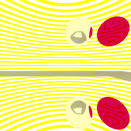
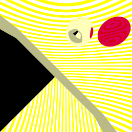
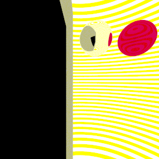

# Aufgabe 8

Metall und Glass

Leider entsteht bei mir immer noch bei der Rotation eine grosse schwarze Flecke. Ich habe versucht heute den ganzen Tag es zu lösen, leider vergeblich. Hoffentlich wird es reichen, um diese Lösung zu akzeptieren. Die Implementierung von Glass und Metal-Oberfläche habe ich richtig bzw. fast richtig implementiert. Leider hat es nicht mehr zeitlich mit einem schönen Aussicht geklappt, deshalb sieht meine Aussicht nicht besonders schön aus. :-(

## Aufgabe 8.1: Poliertes Metall

Ich habe eine neue Klasse MetalMaterial erstellt, die die Klasse Material implementiert. Da ich schon diese Klasse für die Aufgabe 8.2 modifiziert habe. Der Fall für ein poliertes Metall ist denn, wenn Streeung = 0 ist. Die Kern der Lösung liegt in der Methode scattered.


```java
    public Scattered scattered(Ray r, Hit h) {
        Vec3 x = h.intersection;
        Vec3 strahlrichtung = r.normalisierteRichtung;
        Vec3 normalenvektor = h.normalenvektor;
        //Vec3 reflexionsrichtung = strahlrichtung.minus((normalenvektor.elementaryMultiply(strahlrichtung)).skalar(2).elementaryMultiply(normalenvektor));
        Vec3 reflexionsrichtung = strahlrichtung.minus(normalenvektor.skalar(2 * (normalenvektor.skalar(strahlrichtung))));

        Vec3 randomVec = new Vec3(2 * cgtools.Random.random() - 1, 2 * cgtools.Random.random() - 1, 2 * cgtools.Random.random() - 1);
        Vec3 addRanVec = reflexionsrichtung.normalisierung().add(randomVec);
        Vec3 scatteredRichtung = reflexionsrichtung.add(addRanVec.skalar(streuungsfaktor));
                Ray scattered = new Ray(x, scatteredRichtung);
        if (scatteredRichtung.skalar(normalenvektor) < 0) {
            return null;
        }


        return new Scattered(scattered, albedoFarbe)
    }
    
    
}
}
```

## Aufgabe 8.2: Angeschliffenes Metall


Ich habe meine Klasse MetalMateriall um ein Streeungsfaktor erweitert. 

```java
    public MetalMaterial(Vec3 albedoFarbe, double streuungsfaktor) {

        this.albedoFarbe = albedoFarbe;
        this.streuungsfaktor = streuungsfaktor;
    }
```

Danach habe ich einfach am Ende die Formel aus der Vorlesung benutzt und das wars eigentlich.

```java
  Vec3 randomVec = new Vec3(2 * cgtools.Random.random() - 1, 2 * cgtools.Random.random() - 1, 2 * cgtools.Random.random() - 1);
        Vec3 addRanVec = reflexionsrichtung.normalisierung().add(randomVec);
        Vec3 scatteredRichtung = reflexionsrichtung.add(addRanVec.skalar(streuungsfaktor));
                Ray scattered = new Ray(x, scatteredRichtung);
        if (scatteredRichtung.skalar(normalenvektor) < 0) {
            return null;
        }

```

## Aufgabe 8.3: Glass

In diesem Fall habe ich versucht so gut wie möglich den Pseudocode aus der Vorlesung zu übersetzen in Java. Ich weiss nicht, ob ich es geschafft habe. Sieht aber schon (fast) gut aus. Die Kern der Lösung liegt in der Klass GlassMaterial, die die Klasse Material implementiert.


```java
  public Scattered scattered(Ray ray, Hit h) {
    Vec3 normale = h.normalenvektor;
    double r = 1.0/1.5;
    double c = normale.skalar(ray.normalisierteRichtung)*(-1);
    
    Ray scattered = null;
    double schlick = Math.pow((1.0-1.5)/(1.0+1.5),2);
    if (normale.skalar(ray.normalisierteRichtung)>0){
        normale=normale.skalar(-1);
        r=1.5/1.0;
    }
    double dis =1-r*r*(1-c*c);
    
    if (dis>0){
        if (schlick<cgtools.Random.random()){
            Vec3 transmission = ray.normalisierteRichtung.skalar(r).add(normale.skalar((r*c-Math.sqrt(dis))));
            scattered = new Ray(h.intersection, transmission);
        
        return new Scattered(scattered, albedoMaterial);
        
    }
    else {
       Vec3 reflexion = ray.normalisierteRichtung.minus(normale.skalar(2*(normale.skalar(ray.normalisierteRichtung))));
       scattered = new Ray(h.intersection, reflexion);
       
      return new Scattered(scattered, albedoMaterial);  
    }
        
    }
    else {
  Vec3 reflexion = ray.normalisierteRichtung.minus(normale.skalar(2*(normale.skalar(ray.normalisierteRichtung))));
       scattered = new Ray(h.intersection, reflexion);
       
      return new Scattered(scattered, albedoMaterial);      }
        
        
    }
    
```

## 8.4 Ansichten einer Szene

Meine Szene entsteht es 3 Hauptelementen: aus einenm Spiegel unten, einem Metalkugel links oben und einem Glasskugel rechts oben. Wenn ich die Spiegel ab 30 Grad, dann kommt eine grosse schwarze Flecke, die ich bis jetzt leider nicht weiss, wie ich es behoben kann.

```java
 spiegel = new Shape[2];
        spiegel[0] = new Rectangle(220, 220, new LambertMaterial(new Vec3(0.5, 0.5, 0.5)));

        spiegel[1] = new Rectangle(100, 100, new MetalMaterial(new Vec3(1, 1, 1), 0));

        
        shapes = new Shape[4];
        shapes[0] = new Background(backgroundMat);
        shapes[1] = new Sphere(new Vec3(30, 60, -90), new MetalMaterial(new Vec3(1, 1, 1), 0), 20);

        shapes[2] = new Sphere(new Vec3(80, 60, -90), new GlassMaterial(new Vec3(212.0 / 255.0, 0, 79.0 / 255.0)), 20);

        shapes[3] =  new Group(spiegel, new Transform(Mat4.rotate(0,0,1,90)));
        
       
```



Ein reguläres Bild. Sieht so aus wie ich mir fast vorgestellt habe.



Es kommt ein Fehler: Bei der Rotation um 45 Grad, die Hälfte der Spiegel ist schwarz



Es kommt ein Fehler: Bei der Rotation um 90 Grad, der ganze Spiegel ist schwarz

## Quellen
Nur Folien aus der Vorlesung.
