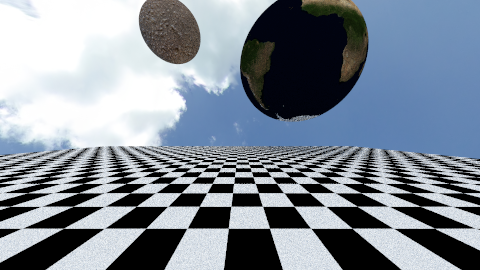
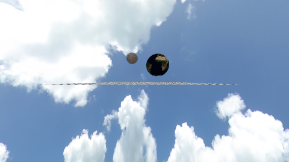
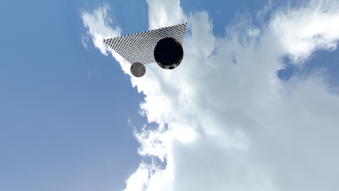

# Aufgabe 9

Wolken am Himmel

## Aufgabe 9.1: Texturen

Ich habe ein geeignetes Interface Texture und die entsprechende Texture-Objekten sowie auf der Vorlesung implementiert. Ein Beispiel für ein Phototexture:

```java
public class PhotoTexture implements Texture {

    ImageTexture texture;

    public PhotoTexture(String pfad) {
        try {
            texture = new ImageTexture(pfad);
        } catch (IOException ex) {
            Logger.getLogger(PhotoTexture.class.getName()).log(Level.SEVERE, null, ex);

        }
    }

    @Override
    public Vec3 sample(Vec3 uv) {
        
    double xcut = uv.x-Math.floor(uv.x);
    double ycut = uv.y-Math.floor(uv.y);

      return Scene.gammakorrektur(texture.samplePoint(xcut, ycut), 1/(2.2f));

    }

}
```

Ich habe bei der Hit Klasse ein neues Parameter texturekoordinaten hinzugefügt, um die Berechnung für die texturekoordinaten zu speichern. 

```java
 public Hit(double t, Vec3 intersection, Material material, Vec3 normalenvektor, Vec3 texturekoordinaten){
        this.t =t;
        this.intersection=intersection;
        this.material=material;       
        this.normalenvektor=normalenvektor.normalisierung();
        this.texturekoordinaten=texturekoordinaten;
        
    }
```

Und hier die entsprechende Berechnungen für die Texturekoordinaten:

Ebene:
```java
             hit = new Hit(t, pos, material, n, new Vec3(pos.x/this.width+0.5, pos.z/this.height+0.5,0));
```


Kreis:
```java
  Vec3 hitposition = ray.pointAt(t);
             Vec3 normal = (hitposition.minus(position)).skalar(1/r);
             double inclination = Math.acos(normal.y);
             double azimuth = Math.atan2(normal.x, normal.z);
             double u = (azimuth+Math.PI)/(2*Math.PI);
             double v = inclination/Math.PI;
             return new Hit(t, hitposition, material, normal, new Vec3(u,v,0));
```

Hintergrund:
```java
 Vec3 hitposition = ray.pointAt(ray.t1);
             Vec3 normal = ray.normalisierteRichtung;
             double inclination = Math.acos(normal.y);
             double azimuth = Math.atan2(normal.x, normal.z);
             double u = (azimuth+Math.PI)/(2*Math.PI);
             double v = inclination/Math.PI;
        
                
       return new Hit(ray.t1, hitposition, material, new Vec3(0,0,0), new Vec3(u,v,0));  
```


Ich habe bei jeder Material-Klassen, die Albedo/Emissivität von Typ Vec3 auf Texture geändert.

## Aufgabe 9.2: Ansichten einer Szene 



Ein reguläres Bild. Sieht so aus wie ich mir fast vorgestellt habe.



Bisschen weiter. 



Von hinten und weit weit weg. 

## Quellen
Nur Folien aus der Vorlesung.
