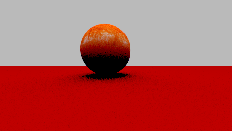
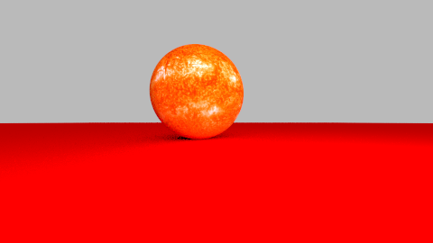
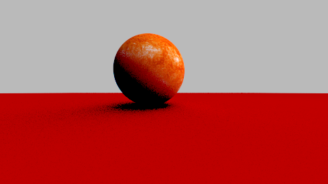

# Aufgabe 10

Licht und Schatten

## Aufgabe 10.1: Punktlichtquellen

Ich habe ein geeignetes Interface LightSource und die entsprechende LightSource-Klasse PointLight, die von dieser Interface abgeleitet ist sowie auf der Vorlesung implementiert. Die Methode sample gibt eine LightSample Klasse zurück, die zwei Vec3 Objekten als Parameter im Konstruktor braucht. 

```java
public class PointLight implements LightSource {

    Vec3 position;
    Vec3 intensity;

    public PointLight(Vec3 position, Vec3 intensity) {
        this.position = position;
        this.intensity = intensity;

    }

    @Override
    public LightSample sample(Group group, Vec3 fromPoint) {
        Vec3 incident = position.minus(fromPoint).normalisierung();
        Vec3 radiance = null;

        if (group.visible(position, fromPoint)) {

            radiance = intensity.skalar(1 / distanceSquared(fromPoint, position));
            return new LightSample(radiance, incident);

        }
        return new LightSample(new Vec3(1, 1, 1), incident);
    }

    private double distanceSquared(Vec3 fromPoint, Vec3 toPoint) {
        Vec3 result = fromPoint.minus(toPoint);

        return result.skalar(result);

    }
}
```

Die Kern der Lösung findet man hier eigentlich in der methode sample. Ich habe einfach der c++ Formel aus der Vorlesung entsprechend modifiziert. Die visible Methode von group gibt zurück ob das Licht sichtbar ist aus diesem Punkt. So wie an der Tafel haben wir gelernt, wie man es machen kann:

```java
 public boolean visible(Vec3 from_point, Vec3 position) {

        Ray visibility = new Ray(position, position.minus(from_point).normalisierung(), 0.00001, position.minus(from_point).laenge());
        //    System.out.println(getHit(visibility) == null);
        //System.out.println(getHit(visibility) == null);
        return getHit(visibility) == null;

    }
```
Dafür habe ich auch meine Ray-Klasse modifiziert. t0 und t1 wird diesmal nicht automatisch auf 0.0001 und infinity gesetzt, sondern über Konstruktor als Parameter übergeben. Ich prüfe auch jetz in Background-Klasse in meiner getHit Methode, ob t1 gleich infinity ist. Wenn das stimmt, dann es gibt einen Trefferpunkt mit dem Hintergrund und wird enstprechend berechnet, sonst wird null zurückgegeben. 

Meine calculateRadiance()-Methode habe ich auch enstprechend, so wie auf den Folien steht, modifiziert. Das war eine trivial Aufgabe, man muesste eigentlich nur den Code abschreiben.

Ebene:
```java
 public Vec3 calculateRadiance(Group group, Ray ray, int depth) {
        if (depth == 0) {
            return new Vec3(0, 0, 0);
        }
        Hit hit = group.getHit(ray);

        Vec3 emitted = hit.material.emitted(ray, hit);
        Scattered scattered = hit.material.scattered(ray, hit);
        if (scattered == null) {

            return emitted;

        } else {
            Vec3 direct = new Vec3(0, 0, 0);
            if (((hit.material) instanceof LambertMaterial)) {

                for (LightSource light : lights) {

                    LightSample sam = light.sample(group, hit.intersection);

                    direct = direct.add(sam.radiance.skalar(hit.normalenvektor.skalar(sam.incident)));

                }

            }

            return emitted.add(scattered.albedo.sample(hit.texturekoordinaten)).elementaryMultiply(direct.add(calculateRadiance(group, scattered.scattered, depth - 1)));

        }

    }
```

## Aufgabe 10.2: Ansichten einer Szene 



Beleuchtung von oben



Beleuchtun von vorne. 



Beleuchtung von oben rechts

## Quellen
Nur Folien aus der Vorlesung.
