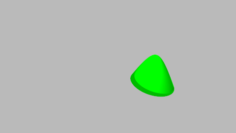
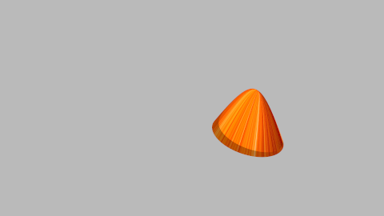
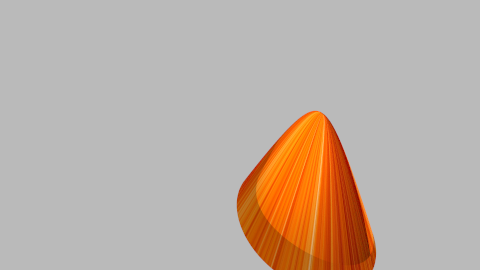
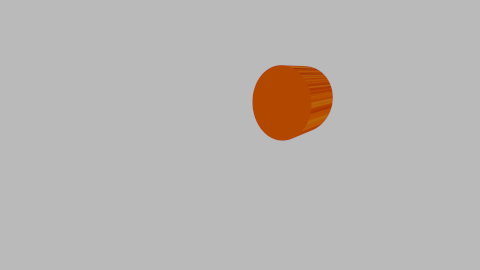
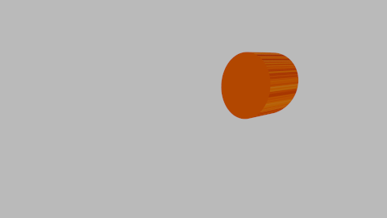
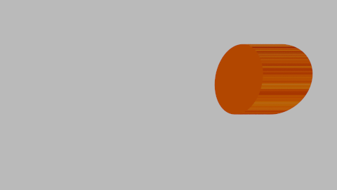
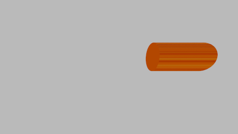

# Bonusaufgabe 1

Zylinder und Kegel 

## Aufgabe 1.1: Zylinder

Ich habe mich sehr nach der Quellen aus dem Internet inspiriert. Ich habe eine neue Klasse Cylinder ertellt die das Interface Shape implementiert. In der Konstruktor muss man folgende Parameter eingeben: Material von Typ Material, center von Typ Vec3 (gib an wo sich die Zylinder befinden soll, radius gibt die Größe des Kugels als Double und height gibt die Höhe bzw Länge des Zylinders als double


```java
 public class Cylinder implements Shape {
	
	Material material;
        Vec3 center;
        double radius;
        double height;
	
	public Cylinder(Material material,Vec3 center, double radius, double height) { 
   this.material=material;
   this.center=center;
   this.radius=radius;
   this.height=height;
   
   
}
    }
}
```

Ich habe danach getHit-Methode überschrieben und habe dem Code aus dem Internet einfach für unsere Raytracer angepasst. Man rechnet erstmal die a,b,c für die quadratische Gleichung an. Danach wurden alle Werte (hit treffer) nach der Größe sortiert, sodass wir der erste Treffer finden können. Danach wird einfach geprüft, wo und wann wurde zuerst getroffen, sodass Normalenvektor entsprechend modifiziert werden kann. Danach habe ich noch unsere Werte aus der Vorlesung für die Berechnung des Texturekoordinate enstprechend modifiziert.

```java
  public Hit getHit(Ray ray) {
	Vec3 eminusc = ray.ursprung.minus(center);
		
		double a = Math.pow(ray.normalisierteRichtung.x, 2) + Math.pow(ray.normalisierteRichtung.y, 2);
		double b = 2 * (ray.normalisierteRichtung.x * eminusc.x + ray.normalisierteRichtung.y * eminusc.y);
		double c = Math.pow(eminusc.x, 2) + Math.pow(eminusc.y, 2) - Math.pow(radius, 2);
		double discriminant = b * b - 4 * a * c;
		if (discriminant < 0) {
			return null;
		}
		
		double t1 = Math.min((-b + Math.sqrt(discriminant)) / (2 * a), (-b - Math.sqrt(discriminant)) / (2 * a));
    double t2 = (height / 2.0 - eminusc.z) / ray.normalisierteRichtung.z;
    double t3 = (-height / 2.0 - eminusc.z) / ray.normalisierteRichtung.z;
    
    // We'll iterate through the values in sorted order so we find closest intersection first
    double[] tarr = {t1, t2, t3};
    Arrays.sort(tarr);
    Vec3 normal = null;
    Double t = null;                 // The lowest intersection we find
    for (double x : tarr) {
        Vec3 location = ray.pointAt(x);
      
      if (x == t1) {
        if (Math.abs(location.z - center.z) < height / 2.0) {
          normal = new Vec3(location.x - center.x, location.y - center.y,0).normalisierung();
          t = x;
          break;
        }
      } else {
        if (Math.pow(location.x - center.x, 2)
            + Math.pow(location.y - center.y, 2) 
            - Math.pow(radius, 2) <= 0) {
          if (x == t2) {
            normal = new Vec3(0, 0, 1);
          } else if (x == t3) {
            normal = new Vec3(0, 0, -1);
          }
          
          t = x;
          break;
        }
      }
    }
    
    if (t == null || t > ray.t1|| t < ray.t0) {
      return null;
    }
            Vec3 location = ray.pointAt(t);
   // public Hit(double t, Vec3 intersection, Material material, Vec3 normalenvektor, Vec3 texturekoordinaten){
               double inclination = Math.acos(normal.y);
             double azimuth = Math.atan2(normal.x, normal.z);
             double u = (azimuth+Math.PI)/(2*Math.PI);
             double v = inclination/Math.PI;
		return new Hit(t,location,material,normal,new Vec3(u,v,0));
	}
```

## Aufgabe 1.2: Kegel

Ich habe mich sehr nach der Quellen aus dem Internet inspiriert. Leider meine Kegel an der Spitze ist abgerundet. Ich habe eine neue Klasse Kegel erstellt die das Interface Shape implementiert. In der Konstruktor muss man folgende Parameter eingeben: Material von Typ Material, top von Typ Vec3 (gib an wo sich die Spitze des Kegels befinden soll, gleichzeitig auch wo sich die Kegel allgemein befinden soll, bottomRadius gibt die Größe des Kugels unten an als Double und height gibt die Höhe des Kegels s als double


```java
 public class Kegel implements Shape {

    /**
     * Constructor of a sphere with a given center and radius.
     *
     * @param top Top of the cone.
     * @param height Height of the cone.
     * @param bottomRadius Radius of the bottom cap of the cone.
     */
    Vec3 top;
    double height;
    double bottomRadius;
    Material material;

    public Kegel(Material m, Vec3 top, double height, double bottomRadius) {
        this.top = top;
        this.height = Math.abs(height);
        this.bottomRadius = Math.abs(bottomRadius);
        this.material = m;
    }
   
   
}
    
```

Ich habe danach getHit-Methode überschrieben und habe dem Code aus dem Internet einfach für unsere Raytracer angepasst. Man rechnet erstmal die a,b,c für die quadratische Gleichung an. Dafür habe ich eine Methode einfach aus dem Internet genommen, die die quadratishe Gleichung löst:

```java
double[] SolveQuadrEq(double a, double b, double c) {
        double d = b * b - 4 * a * c;

        if (d < 0) {
            return new double[0]; // lustig, dass das geht :)
        } else if (d == 0) {
            double ret[] = new double[1];
            ret[0] = -b / (2 * a);
            return ret;
        } else {
            double ret[] = new double[2];
            double sqrtD = Math.sqrt(d);
            // first index should be smaller value
            if (a < 0) {
                ret[0] = (-b + sqrtD) / (2 * a);
                ret[1] = (-b - sqrtD) / (2 * a);
            } else {
                ret[1] = (-b + sqrtD) / (2 * a);
                ret[0] = (-b - sqrtD) / (2 * a);
            }
            return ret;
        }
    }
```

Danach habe ich auch eine Methode übernommen, die minimum und maximum Werte zw. zwei Vektoren speichert.

```java
  public void getMinMaxXYZ(Vec3 min, Vec3 max) {
        min.x = top.x - bottomRadius;
        min.y = top.y - height;
        min.z = top.z - bottomRadius;
        max.x = top.x + bottomRadius;
        max.y = top.y;
        max.z = top.z + bottomRadius;
    }
```

Ich habe die getHit Methode überschrieben und dafür die Methode aus dem Internet entsprechend modifziert, sodass die entsprechend für unsere Raytracer passt.

```java
  public Hit getHit(Ray ray) {
// calculate r^2/h^2
        double rh = bottomRadius / height;
        rh *= rh;

        double a = ray.normalisierteRichtung.x * ray.normalisierteRichtung.x
                + ray.normalisierteRichtung.z * ray.normalisierteRichtung.z
                - ray.normalisierteRichtung.y * ray.normalisierteRichtung.y * rh;

        double b = 2 * ray.normalisierteRichtung.x * (ray.ursprung.x - top.x)
                + 2 * ray.normalisierteRichtung.z * (ray.normalisierteRichtung.z - top.z)
                - 2 * ray.normalisierteRichtung.y * (ray.normalisierteRichtung.y - top.y) * rh;

        Vec3 ot = ray.ursprung.minus(top);
        double cyh = (height + top.y);
        cyh *= cyh;

        double c = ot.x * ot.x + ot.z * ot.z - (ot.y * ot.y) * rh;

        double solutions[] = SolveQuadrEq(a, b, c);

        for (double s : solutions) {
            if (s > 0) {
                Vec3 intPos = ray.ursprung.add(ray.normalisierteRichtung.skalar(s));

                if (intPos.y > top.y || intPos.y < top.y - height) {
                    continue;
                }

                float normalY = (float) (bottomRadius / Math.sqrt(bottomRadius * bottomRadius + height * height));

                Vec3 normal = intPos.minus(top);
                normal.y = 0;
                normal.normalisierung();
                normal = normal.skalar(Math.sqrt(1 - normalY * normalY));
                normal.y = normalY;

                // negate normal if ray hits the cone from inside to outside
                if (normal.skalar(ray.normalisierteRichtung) > 0) {
                    normal = normal.skalar(-1);
                }
                double inclination = Math.acos(normal.y);
                double azimuth = Math.atan2(normal.x, normal.z);
                double u = (azimuth + Math.PI) / (2 * Math.PI);
                double v = inclination / Math.PI;

                return new Hit(s, intPos, material, normal, new Vec3(u, v, 0));
            }
        }

        return null;
    }
```


## Aufgabe 1.3: Ansichten einer Szene 



Kegel mit konstannter Farbe (leider mit abgerundeten Spitze)



Kegel mit Fototextur (leider mit abgerundeten Spitze)



Kegel mit Fototextur (leider mit abgerundeten Spitze), bisschen grosser



Zylinder, schraeg mit Fototextur



Zylinder, schraeg mit Fototextur



Zylinder, paraller zu x achse, mit Fototextur



Zylinder, bisschen kleiner und länger

## Quellen
http://woo4.me/wootracer/cylinder-intersection/
https://github.com/cfstras/Raytracer/blob/master/src/de/tum/ws2010/propra/raytracer/primitives/Cone.java
https://github.com/lambdabaa/RayTracer/blob/master/ray/ray/surface/Cone.java

