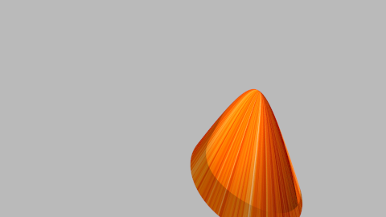
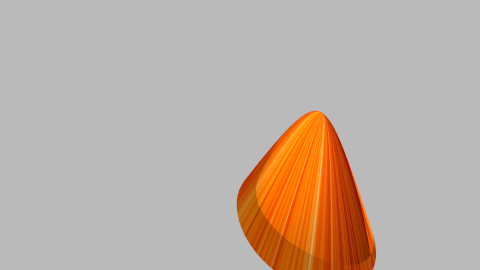

# Bonusaufgabe 3

Parallelisierung 

## Aufgabe 3.1: Parallelisierung 

Ich habe mich auf die Parallelisierung auf die Pixel-Ebene (zeilenweise) entschieden. Dafür habe ich eine neue Klasse MyThread erstellt als Unterklasse von java Standard Klasse Thread. Im parameter gibt man ab welchen y Wert Thread anfangen soll und ab welchen y-Wert enden soll. Dann gibt man noch die kamera, group und scene Objekte hinzu und die scanrate. Alles was man braucht für die Methode raytrace von der Scene Klasse. 

```java
Vec3[][] pixels;
    int start, finish;
    Kamera kamera;
    Group group;
    int scanrate;
    Scene scene;
 public MyThread(int start, int finish, Kamera kamera, Group group, int scanrate, Scene scene) {
        this.start = start;
        this.finish = finish;
        this.kamera = kamera;
        this.group = group;
        this.scanrate = scanrate;
        this.scene = scene;
        System.out.println(this.start + " - " + this.finish + " : " + this.getName());
    }
```

Wir schreiben die run methode über und wir geben die pixels Werte als zweidimensionaler Array von Vec3 mit der Hilfe von der methode aus der Scene Klasse - raytrace().

```java
public void run() {
        pixels = scene.raytrace(kamera, group, scanrate, start, finish);
        System.out.println(this.getName() + " finished");

```

Dafür muss man die Methode raytrace entsprechend ändern. Vorher hat sie direkt Image Objekt zurückgegeben, jetzt geht es leider nicht mehr. Ich habe diese Methode um zwei neue Parameter erweitert als Integer: start und finish. Und die gibt jetzt statt Image ein zweidimensionaler Array Vec3[][] zurück. 

```java
 public Vec3[][] raytrace(Kamera kamera, Group shapes, int abtastrate, int start, int finish) {
        Vec3[][] result = new Vec3[kamera.width][kamera.height];
        for (int x = 0; x != kamera.width; x++) {
            for (int y = start; y != finish; y++) {
                Vec3 vectemp = new Vec3(0.0, 0.0, 0.0);

                for (int xi = 0; xi < abtastrate; xi++) {
                    for (int yi = 0; yi < abtastrate; yi++) {
                        double rx = cgtools.Random.random();
                        double ry = cgtools.Random.random();
                        double xs = x + ((xi + rx) / abtastrate);
                        double ys = y + ((yi + ry) / abtastrate);

                        Ray ray = kamera.generateRay(xs, ys);
                        Hit hit = shapes.getHit(ray);
                        if (hit != null) {

                            vectemp = vectemp.add(calculateRadiance(shapes, ray, 7));

                        }
                    }

                }
                //  System.out.println("x"+vectemp.x+"y"+vectemp.y+"z"+vectemp.z);
                vectemp = vectemp.skalar(1.0 / (abtastrate * abtastrate));
                // System.out.println("x"+vectemp.x+"y"+vectemp.y+"z"+vectemp.z);

                result[x][y] = gammakorrektur(vectemp, 2.2f);
            }
        }

        return result;
    }
```

Im Main-Klasse habe ich enstprechend vier verschiedene Kerne erstellt und als Array von MyThreads gespeichert.

```java
  MyThread thread1 = new MyThread(0, kamera.HEIGHT / 4, kamera, gruppe, scanrate, SCENE);
        MyThread thread2 = new MyThread(kamera.HEIGHT / 4, kamera.HEIGHT - kamera.HEIGHT / 2, kamera, gruppe, scanrate, SCENE);
        MyThread thread3 = new MyThread(kamera.HEIGHT - kamera.HEIGHT / 2, kamera.HEIGHT - kamera.HEIGHT / 4, kamera, gruppe, scanrate, SCENE);
        MyThread thread4 = new MyThread(kamera.HEIGHT - kamera.HEIGHT / 4, kamera.HEIGHT, kamera, gruppe, scanrate, SCENE);
        MyThread[] threads = {thread1, thread2, thread3, thread4};
```

Danach habe ich alle Threads gestartet und mit Hilfe der Methode join synchronisiert

```java
for (MyThread t : threads) {
            t.start();
            
        }
       

        for (MyThread t : threads) {
            try {
                t.join();
            } catch (InterruptedException e) {
                e.printStackTrace();
            }
        }

```

Und ganz am Ende habe ich einfach die Werte des Threads geholt und in Image enstprechend gespeichert.

```java
Image image = new Image(kamera.width, kamera.height);
        for (MyThread t : threads) {
            for (int x = 0; x != kamera.width; x++) {
                for (int y = t.start; y != t.finish; y++) {
                    image.setPixel(x, y, t.pixels[x][y]);
                }
            }
        }

        image.write("multithread.png");

```

## Aufgabe 3.2: Ansichten einer Szene 



Bild erzeugt ohne Multithreading

```java
24465
BUILD SUCCESSFUL (total time: 24 seconds)
```



Bild erzeugt mit Multithreading

```java
0 - 67 : Thread-0
67 - 135 : Thread-1
135 - 203 : Thread-2
203 - 270 : Thread-3
Thread-0 finished
Thread-1 finished
Thread-2 finished
Thread-3 finished
14268
BUILD SUCCESSFUL (total time: 14 seconds)
```

Berechnung 24465:14268 <=> 1,71:1 -> das heisst das Bild wurde fast doppelt so schnell erzeugt wie ohne Multithreading. Es ist leider noch weit entfernt von der optimalen Lösung 4:1, ist aber besser als gar nicht. ;-)


## Quellen
Javadoc und Quellen die ich leider nicht mehr gespeichert habe. :-(

